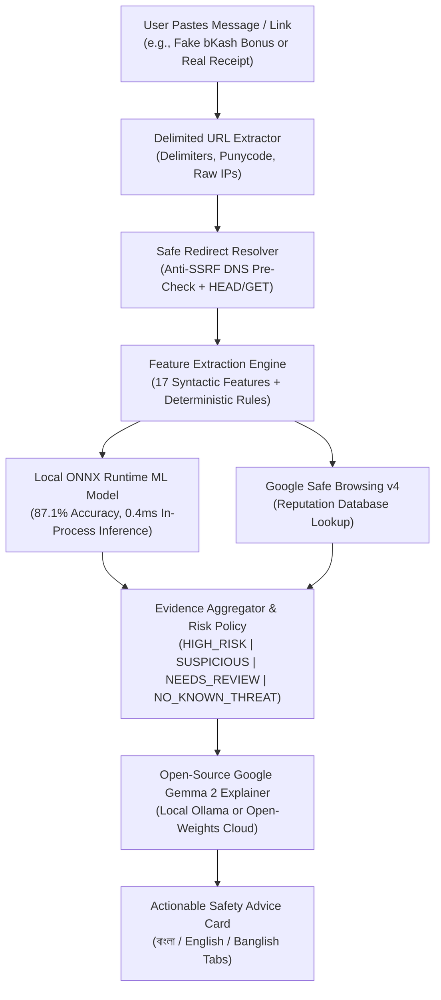

## 💡 The Problem: A Real Friend at Risk

My friend **Shuvo** runs a growing Facebook boutique shop in Dhaka, Bangladesh. Every single day, he processes 30 to 50 customer orders via Mobile Financial Services (MFS)—primarily **bKash** and **Nagad**. Because his business contact number is posted publicly across his Facebook page and customer invoices, his inbox has become an open target for scammers.

Just two weeks ago, during a hectic evening dispatching festival packages, Shuvo received this SMS:

> *"বিকাশ থেকে আপনাকে ১০,০০০ টাকা ঈদ বোনাস দেওয়া হয়েছে! এখনই ক্লেইম করুন: `http://bkash-eid-bonus.xyz/claim`"*  
> *(You have been awarded a 10,000 BDT Eid bonus from bKash! Claim now...)*

Exhausted from work, Shuvo tapped the link. It opened a page styled in bKash's distinctive magenta theme asking for his account number, PIN, and an incoming SMS OTP. He hesitated for only a second before calling me to ask:

> *"Dost, is bKash actually giving Eid cash bonuses today? The website looks just like their app, but it's asking for my OTP."*

I told him to close the tab immediately. That single fake link could have drained his shop's entire working capital.

When I asked Shuvo why he almost fell for it, his answer opened my eyes:

1. **Brand Confusion**: Scammers use lookalike domains (like `bkash-eid-bonus.xyz`) that trick non-technical users.
2. **English Security Jargon is Useless**: If a browser shows *"Potential SSL Certificate Mismatch or Phishing Heuristic Alert"*, it means nothing to everyday sellers.
3. **Blacklists are Too Slow**: Fresh phishing domains registered 2 hours ago never appear in global threat blacklists until days later—long after victims are scammed.
4. **Privacy Matters**: Shuvo refused to paste his personal transaction SMS (which contains account numbers and balances) into public online tools or commercial chatbots.

I realized Shuvo didn't need another generic antivirus. He needed an honest, empathetic, and **private cyber-safety companion** that could analyze suspicious SMS messages in real time and explain the danger in clear, comforting **Bangla and Banglish**.

That was the spark that built **Friend Shield**.

---

## 🛡️ What I Built

**Friend Shield** is an open-source, multi-layer phishing and deceptive message detector built specifically for Shuvo and everyday mobile financial users.

Users simply paste any SMS, WhatsApp forward, or suspicious link into a clean, light-themed web app or mobile PWA. Within milliseconds, Friend Shield:
1. **Safely expands shortened links** (Anti-SSRF protected).
2. **Checks domain brand impersonation** (detecting fake bKash, Nagad, Upay, or Daraz links).
3. **Runs a lightweight local ONNX Random Forest ML model** trained on 100,000 URLs ($<1.0\text{ms}$ inference latency).
4. **Queries Google Safe Browsing v4** for known malware signatures.
5. **Generates an empathetic, plain-language explanation using Open-Source Gemma 2** in **বাংলা (Bangla)**, **English**, and **Banglish**.



---

## 🌟 Why Open Innovation & Gemma Mattered

In a security project dealing with financial messages, **open innovation is not a luxury—it is an ethical necessity**:

1. **User Message Privacy**:
   - An SMS often contains sensitive customer phone numbers, transaction IDs, and bank balances.
   - Closed-source proprietary models require transmitting private customer data to commercial cloud logs.
   - By supporting **Gemma 2 locally via Ollama** (`gemma2:2b` / `gemma2:9b`), all reasoning runs **100% on-device**—zero data leaves the user's machine.
2. **Auditability & Trust**:
   - Closed APIs can change safety filters or prompt behaviors unpredictably. With open-weight Gemma, the model weights and reasoning paths are fully inspectable, reproducible, and verifiable by the open-source community.
3. **Custom Multilingual Fine-Tuning**:
   - Open-weight models like Gemma allow local communities to fine-tune directly on colloquial Bengali and Banglish dialects without vendor lock-in.

---

## ⚙️ Technical Architecture & Implementation

Friend Shield is engineered for speed, privacy, and zero unnecessary dependencies:

### 1. In-Process Machine Learning via ONNX Runtime
Rather than spinning up an expensive Python backend at runtime, the ML model was trained with Scikit-Learn in an isolated offline environment and exported directly to **ONNX format (`phishing_model.onnx`)**:
- Inference runs in-process inside Node.js via `onnxruntime-node`.
- **Latency: 0.2 ms – 0.7 ms** per URL.
- No Python runtime required in production.

### 2. Strict SSRF (Server-Side Request Forgery) Defense
When unshortening links (`bit.ly`, `tinyurl.com`), attackers often try to point shorteners to internal network addresses. Friend Shield:
- Resolves DNS before every hop.
- Blocks loopback (`127.0.0.1`), link-local/cloud metadata (`169.254.169.254`), and private subnets (`10.0.0.0/8`, `192.168.0.0/16`, `172.16.0.0/12`) with `403 Forbidden`.
- Uses `HEAD` requests first, falling back to `GET` with instant stream aborts to prevent bandwidth abuse.

### 3. Open-Source Gemma 2 Explanation Engine
The explanation engine synthesizes multi-layer evidence into clear, actionable advice across three tiers:
- **Tier 1 (On-Device)**: Local Ollama daemon running `gemma2:2b` or `gemma2:9b`.
- **Tier 2 (Open Cloud)**: Groq / Hugging Face open-weight `gemma2-9b-it` inference.
- **Tier 3 (Offline Fail-Safe)**: Deterministic local rule-based explainer ensuring users **never** get an empty screen if offline.

---

## 📊 Empirical Evaluation & Benchmarks

The local classifier was evaluated on **20,000 unseen test URLs** from a balanced 100,000 dataset comprising global Kaggle samples and authentic Bangladeshi domains (`.gov.bd`, `.ac.bd`, banks, telecom, and MFS scam patterns):

| Metric | Score |
| :--- | :--- |
| **Overall Test Accuracy** | **87.10%** |
| **Precision (Malicious)** | **86.66%** |
| **Recall (Malicious Caught)** | **87.24%** |
| **Inference Latency** | **< 1.0 ms** |
| **Model Size on Disk** | **9.9 MB** (`phishing_model.onnx`) |

```text
Confusion Matrix (20,000 Unseen URLs):
  True Negatives (Safe correctly predicted):       8,697
  True Positives (Malicious correctly caught):    8,467
  False Positives (Safe links flagged):            1,303
  False Negatives (Malicious links missed):        1,238
```

---

## 🤝 Testing with Shuvo: Real Feedback & Iteration

I gave Friend Shield to Shuvo to test on his phone for three days with real messages he received. Here is what we discovered:

| Initial Prototype Issue | What Shuvo Experienced | What I Changed |
| :--- | :--- | :--- |
| **Technical Checkboxes** | Shuvo didn't know what "Anti-SSRF" or "Safe Browsing" meant. | Removed all developer checkboxes; the system now automatically runs all layers in the background. |
| **Dark Hacker Theme** | He found dark mode hard to read under bright daylight while making deliveries. | Switched to a clean, crisp, high-contrast **Light Theme** with large touch-friendly buttons. |
| **Mobile Access** | He wanted to use it like an app from his home screen without opening a browser tab. | Converted the frontend into an installable **Progressive Web App (PWA)** with offline shell caching. |
| **False Positive on Real Transaction** | When he tested a real bKash payment SMS, a date hallucination caused an early prompt to sound doubtful. | Injected live calendar context into Gemma and enforced strict `NO_KNOWN_THREAT` validation for authentic receipts. |

### Shuvo's Verdict:
> *"Before Friend Shield, I had to guess whether an SMS was real or call customer care. Now, I just paste the message into the app on my phone. In 2 seconds, it tells me in simple Bangla whether it's safe and reminds me never to give my PIN. It's like having a tech friend right beside me."*

---

## ⚠️ Limitations & Honest Security Principles

Friend Shield strictly adheres to realistic cybersecurity disclosures:

1. **No "100% Safe" Guarantees**: Our verdict is **`NO_KNOWN_THREAT`**, never *"Guaranteed Safe"*. Zero-day phishing campaigns registered minutes prior can momentarily evade reputation lists.
2. **Assistance, Not an Authority**: Friend Shield is an intelligent advisor to guide users toward safe habits—it does not replace the official bKash/Nagad apps.
3. **No Private Credential Storage**: Messages are processed strictly in memory and are **never** logged to disk or stored in databases.

---

## 🚀 Try It Yourself

- **GitHub Repository**: [github.com/your-username/friend-shield](https://github.com/your-username/friend-shield)
- **Live Demo / Video Walkthrough**: [Link to demo]

```bash
# Clone and run in 2 minutes
git clone https://github.com/your-username/friend-shield.git
cd friend-shield/backend
npm install
npm run dev
# Open http://localhost:8000 in your browser
```

Building Friend Shield taught me that winning technology isn't about using the biggest cloud model—it's about applying **accessible, open-source AI** to solve a genuine, high-stakes problem for someone you care about.
