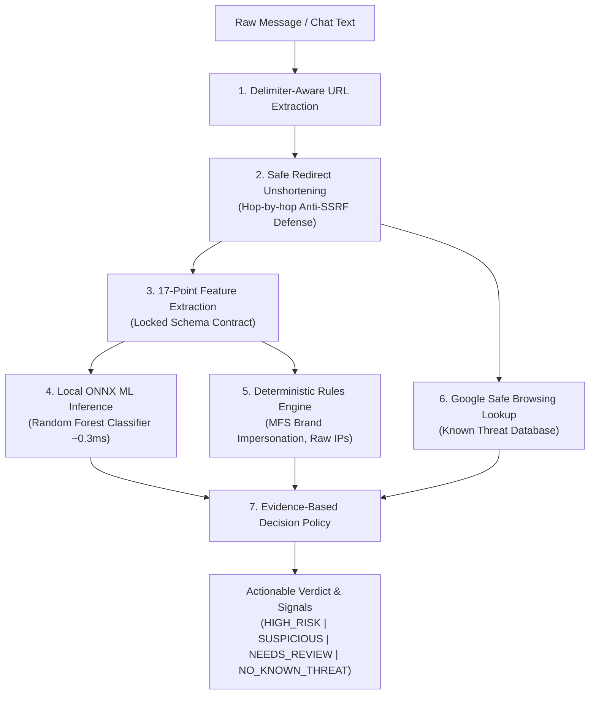

# 🛡️ Friend Shield

> **Multi-Layer Phishing & Scam Detection Engine with Local ML Inference, Safe Redirect Expansion, and Google Safe Browsing Threat Intelligence.**

[](https://nodejs.org/)
[](https://expressjs.com/)
[](https://onnxruntime.ai/)
[](https://scikit-learn.org/)
[](https://developers.google.com/safe-browsing)
[](https://hacktoberfest.com/)

---

## 📌 Problem Statement

Every day, millions of users receive deceptive links through SMS, WhatsApp, Messenger, and social media. In regions like Bangladesh and South Asia, users are heavily targeted with fake cash rewards, lottery traps, and Mobile Financial Service (MFS) scams impersonating **bKash, Nagad, and Upay**.

### Why Single-Layer Detection Fails:
1. **Reputation Blacklists Alone (Google Safe Browsing)**: Highly accurate for known threats, but suffer from **zero-day latency**—newly registered phishing links often remain active for several hours before landing on threat lists.
2. **Pure Machine Learning Alone**: High false-positive rates when tested across diverse domains; prone to dataset sampling bias.
3. **URL Shorteners**: Attackers routinely disguise destinations using services like `bit.ly` or `tinyurl.com` to bypass basic keyword filters.

---

## 💡 The Friend Shield Solution

Friend Shield implements an **evidence-based, multi-layer defense pipeline** running entirely within an Express backend. It pairs real-time blacklist checks with **sub-millisecond local ML inference (ONNX Runtime)** and **deterministic brand impersonation heuristics**, safe redirect unshortening, and full SSRF protection.



---

## 🚀 Key Features & Innovations

- **In-Process Local ML via ONNX Runtime**:
  - Eliminates the need for a secondary Python server at runtime.
  - Random Forest classifier trained on 150,000 balanced URLs from Kaggle's 650k dataset.
  - **Empirical Inference Latency: 0.2 ms – 0.7 ms** per URL.
- **Regional MFS Brand Impersonation Detection**:
  - Identifies lookalike links spoofing **bKash, Nagad, Upay, Daraz, Apple/iCloud, and PayPal**.
  - Flags spoofed domains immediately (e.g., `http://bkash-bonus.xyz` $\rightarrow$ `HIGH_RISK`).
- **Safe Hop-by-Hop Redirect Unshortening**:
  - Automatically expands shortened links (`bit.ly`, `tinyurl.com`, etc.) to find the true landing destination.
  - Fallback mechanism: tries `HEAD` first, gracefully degrades to `GET` for CDNs/services that reject `HEAD`, and cancels response streams immediately to prevent bandwidth drain.
- **Strict SSRF (Server-Side Request Forgery) Defense**:
  - Resolves DNS before every outbound hop.
  - Blocks loopback (`127.0.0.1`), link-local/cloud metadata (`169.254.169.254`), private LANs (`10.0.0.0/8`, `192.168.0.0/16`, `172.16.0.0/12`), and IPv6 equivalents with `403 Forbidden`.
- **Honest, Evidence-Based Decision Policy**:
  - Uses realistic, judge-proof verdicts: **`HIGH_RISK`**, **`SUSPICIOUS`**, **`NEEDS_REVIEW`**, or **`NO_KNOWN_THREAT`**.
  - Never makes unsubstantiated claims like *"100% safe"*.
- **Production Defense & Rate Limiting**:
  - Hardened with `helmet`, dynamic CORS configuration, and dual-layer rate limiting via `express-rate-limit` (general API limiter + strict outbound resolver limiter).

---

## 📊 Empirical ML Evaluation

The local model was trained using Scikit-Learn in an isolated Python environment and exported to standard Open Neural Network Exchange (`.onnx`) format.

### Dataset Overview
- **Source**: Kaggle Malicious URLs & Phishing Dataset (~651,000 URLs).
- **Sampling**: 149,900 balanced URLs (74,950 Benign, 74,950 Malicious).
- **Sampling Bias Mitigation**: Benign URLs were augmented with top-level root domains and realistic modern HTTPS distribution (85% HTTPS) to ensure the model generalizes across both deep paths and root domains.

### Test Split Results (29,980 Unseen URLs)

| Metric | Score |
| :--- | :--- |
| **Overall Test Accuracy** | **86.19%** |
| **Precision (Malicious)** | **87.59%** |
| **Recall (Safe / Benign)** | **88.05%** |
| **F1-Score (Macro Avg)** | **86.19%** |
| **Runtime Inference Latency** | **< 1.0 ms** |
| **Model Size on Disk** | **12.0 MB** (`phishing_model.onnx`) |

#### Confusion Matrix
```text
  True Negatives (Safe correctly predicted):       13,199
  True Positives (Malicious correctly caught):    12,642
  False Positives (Safe links flagged):            1,791
  False Negatives (Malicious links missed):        2,348
```

---

## 🗂️ Project Directory Structure

```text
friend-shield/
├── backend/                             # Production Express API (Runtime)
│   ├── models/
│   │   └── phishing_model.onnx          # Exported ONNX model (~12 MB)
│   ├── src/
│   │   ├── controllers/
│   │   │   ├── analyze.controller.js    # Multi-layer orchestration controller
│   │   │   ├── redirect.controller.js   # Redirect resolution controller
│   │   │   └── safe-browsing.controller.js
│   │   ├── routes/
│   │   │   ├── analyze.routes.js        # /api/analyze endpoints
│   │   │   ├── redirect.routes.js       # /api/redirects endpoints
│   │   │   └── safe-browsing.routes.js  # /api/safe-browsing endpoints
│   │   ├── schemas/
│   │   │   └── feature-schema.json      # Single source of truth for 17 features
│   │   ├── services/
│   │   │   ├── feature-extractor.service.js # 17 numerical features + signals
│   │   │   ├── feature-extractor.test.js    # Automated unit tests
│   │   │   ├── ml-predictor.service.js      # ONNX Runtime inference engine
│   │   │   ├── redirect-resolver.service.js # Hop-by-hop unshortener + SSRF check
│   │   │   ├── safe-browsing.service.js     # Google Safe Browsing API client
│   │   │   └── url-extractor.service.js     # Delimiter & candidate parser
│   │   ├── utils/
│   │   │   ├── errors.js                # Custom domain errors with HTTP status codes
│   │   │   └── ip-validator.js          # IP/CIDR & DNS SSRF validation
│   │   ├── app.js                       # Express app configuration & middleware
│   │   └── server.js                    # Server entry point
│   ├── .env                             # Environment configuration (API keys, ports)
│   └── package.json
│
├── ml-training/                         # Isolated Machine Learning Pipeline
│   ├── data/
│   │   ├── sample_urls.csv              # Starter smoke test dataset
│   │   └── malicious_phish.csv          # Kaggle 651k dataset
│   ├── models/
│   │   └── phishing_model.onnx          # Training artifact
│   ├── src/
│   │   ├── feature_extractor.py         # Python extractor matching schema.json
│   │   └── train.py                     # Training, evaluation & ONNX export script
│   ├── feature-schema.json              # Shared schema contract
│   ├── requirements.txt                 # Python dependencies (scikit-learn, skl2onnx)
│   └── README.md
│
└── README.md                            # Main project documentation
```

---

## 🛠️ Getting Started

### Prerequisites
- **Node.js**: v20+ or v22+
- **npm**: v10+
- **Python**: v3.10+ (Only required if retraining the ML model)
- **Google Safe Browsing API Key**: (Free tier allows 10,000 requests/day)

---

### Installation & Running Backend

1. **Navigate to the backend directory**:
   ```bash
   cd backend
   ```

2. **Install dependencies**:
   ```bash
   npm install
   ```

3. **Configure Environment Variables**:
   Create a `.env` file in `backend/`:
   ```env
   PORT=8000
   CLIENT_URL=http://localhost:5173
   GOOGLE_SAFE_BROWSING_KEY=your_google_safe_browsing_api_key_here
   ```

4. **Start the API server**:
   ```bash
   # Development (with auto-reload)
   npm run dev

   # Production
   npm start
   ```

   The server will start on `http://localhost:8000`.

---

### (Optional) Retraining the ML Model

The trained `phishing_model.onnx` is already included. If you wish to retrain or experiment with new datasets:

```bash
cd ml-training
pip install -r requirements.txt
python src/train.py
```
*The script automatically trains the classifier, outputs performance metrics, and exports the updated `.onnx` model directly into `backend/models/`.*

---

## 📖 API Documentation & Examples

### 1. Analyze Message (Full Pipeline)
Analyzes chat messages, extracts all URLs, unshortens redirects, queries Google Safe Browsing, runs ONNX ML inference, and outputs deterministic risk signals.

- **Endpoint**: `POST /api/analyze/message`
- **Headers**: `Content-Type: application/json`

#### Request:
```json
{
  "message": "Click to claim your prize http://bkash-eid-bonus.xyz/claim and check https://google.com",
  "resolveRedirects": true,
  "checkThreats": true
}
```

#### Response:
```json
{
  "success": true,
  "messageLength": 87,
  "urlCount": 2,
  "threatDetected": true,
  "urls": [
    {
      "original": "http://bkash-eid-bonus.xyz/claim",
      "normalized": "http://bkash-eid-bonus.xyz/claim",
      "safeBrowsing": {
        "knownThreatFound": false,
        "isSafe": true,
        "threats": [],
        "source": "Google Safe Browsing"
      },
      "signals": [
        "The connection is unencrypted (HTTP).",
        "The URL path or query contains sensitive keywords: [claim].",
        "Brand impersonation detected: The URL mimics 'bKash', but does not belong to the official 'bkash.com' domain."
      ],
      "ml": {
        "probability": 0.8124,
        "label": "malicious",
        "inferenceTimeMs": 0.32
      },
      "riskAssessment": {
        "verdict": "HIGH_RISK",
        "confidence": "high",
        "reason": "High-risk pattern detected (e.g. brand impersonation, raw IP, HTTPS downgrade, or @ symbol disguise)."
      }
    },
    {
      "original": "https://google.com",
      "normalized": "https://google.com/",
      "safeBrowsing": {
        "knownThreatFound": false,
        "isSafe": true,
        "threats": [],
        "source": "Google Safe Browsing"
      },
      "signals": [],
      "ml": {
        "probability": 0.0551,
        "label": "safe",
        "inferenceTimeMs": 0.28
      },
      "riskAssessment": {
        "verdict": "NO_KNOWN_THREAT",
        "confidence": "low_to_medium",
        "reason": "No known threats found in Safe Browsing and local ML indicates low risk. (Does not guarantee 100% safety)."
      }
    }
  ]
}
```

---

### 2. Resolve URL Redirects (Unshortener)
Expands a shortened URL safely hop-by-hop with loop detection and SSRF defense.

- **Endpoint**: `POST /api/redirects/resolve`

#### Request:
```json
{
  "url": "https://httpbin.org/redirect/2"
}
```

#### Response:
```json
{
  "success": true,
  "data": {
    "originalUrl": "https://httpbin.org/redirect/2",
    "finalUrl": "https://httpbin.org/get",
    "status": 200,
    "redirectCount": 2,
    "redirects": [
      {
        "status": 302,
        "from": "https://httpbin.org/redirect/2",
        "to": "https://httpbin.org/relative-redirect/1"
      },
      {
        "status": 302,
        "from": "https://httpbin.org/relative-redirect/1",
        "to": "https://httpbin.org/get"
      }
    ]
  }
}
```

---

### 3. Check Google Safe Browsing Directly
Directly checks URLs against Google's real-time threat database.

- **Endpoint**: `POST /api/safe-browsing/check`

#### Request:
```json
{
  "urls": [
    "http://testsafebrowsing.appspot.com/s/malware.html",
    "https://google.com"
  ]
}
```

#### Response:
```json
{
  "success": true,
  "totalChecked": 2,
  "results": [
    {
      "url": "http://testsafebrowsing.appspot.com/s/malware.html",
      "isSafe": false,
      "threats": [
        {
          "threatType": "MALWARE",
          "platformType": "ANY_PLATFORM",
          "cacheDuration": "300s"
        }
      ]
    },
    {
      "url": "https://google.com",
      "isSafe": true,
      "threats": []
    }
  ]
}
```

---

### 4. Health Check
- **Endpoint**: `GET /health`
- **Response**: `{"status": "ok", "timestamp": "2026-10-02T16:45:00.000Z"}`

---

## 🎯 Hackathon Verdict Policy (Judge-Proof Design)

Rather than letting an opaque ML number decide everything, Friend Shield follows a transparent, defense-in-depth policy:

```text
1. If Google Safe Browsing match:
   └── Final Verdict: HIGH_RISK (Confirmed Threat)

2. Else if critical deterministic signal triggered (Brand Impersonation, Raw IP, HTTPS Downgrade, @ Symbol):
   └── Final Verdict: HIGH_RISK (Structural Hazard)

3. Else if Local ML probability >= 0.80:
   └── Final Verdict: SUSPICIOUS (High ML Probability)

4. Else if Local ML probability >= 0.50 or multiple risk signals present:
   └── Final Verdict: NEEDS_REVIEW (Moderate Risk)

5. Else:
   └── Final Verdict: NO_KNOWN_THREAT (Low Risk)
```

> [!NOTE]
> **Ethical AI Disclaimer**: A verdict of `NO_KNOWN_THREAT` indicates that the URL is not currently listed on threat lists and exhibits low statistical risk. It does not provide an absolute guarantee of safety.

---

## 🔮 Future Roadmap

- [ ] **Open-Source Local LLM Explanation Layer**: Generate contextual explanations in simple Bangla and English (e.g. *"এই লিংকটিতে আপনার বিকাশ পিন বা ওটিপি কখনো দিবেন না"*).
- [ ] **Browser Extension**: Real-time page warning banner on phishing landing pages.
- [ ] **WhatsApp & Telegram Bot**: Forward suspicious messages directly to a Friend Shield bot for instant analysis.
- [ ] **Crowdsourced Scam Submissions**: Regional threat feed for Bangladesh e-Gov CIRT and cyber safety organizations.

---

## 📄 License & Terms

- Developed for **Hacktoberfest 2026**.
- Safe Browsing queries are powered by the **Google Safe Browsing API (v4)** for non-commercial safety purposes in accordance with Google's Safe Browsing Terms of Service.
