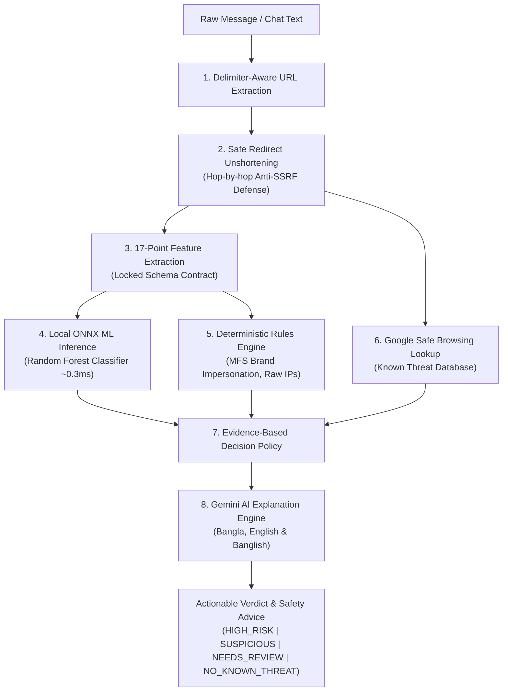

# 🛡️ Friend Shield

> **Multi-Layer Phishing & Scam Detection Engine with Local ML Inference, Safe Redirect Expansion, Google Safe Browsing, and Gemini Multilingual AI Explanations.**

[](https://nodejs.org/)
[](https://expressjs.com/)
[](https://onnxruntime.ai/)
[](https://scikit-learn.org/)
[](https://developers.google.com/safe-browsing)
[](https://aistudio.google.com/)
[](https://hacktoberfest.com/)

---

## 📌 Problem Statement

Every day, millions of users receive deceptive links through SMS, WhatsApp, Messenger, and social media. In regions like Bangladesh and South Asia, users are heavily targeted with fake cash rewards, lottery traps, and Mobile Financial Service (MFS) scams impersonating **bKash, Nagad, and Upay**.

### Why Single-Layer Detection Fails:
1. **Reputation Blacklists Alone (Google Safe Browsing)**: Highly accurate for known threats, but suffer from **zero-day latency**—newly registered phishing links often remain active for several hours before landing on threat lists.
2. **Pure Machine Learning Alone**: High false-positive rates when tested across diverse domains; prone to dataset sampling bias.
3. **URL Shorteners**: Attackers routinely disguise destinations using services like `bit.ly` or `tinyurl.com` to bypass basic keyword filters.
4. **The Communication Gap**: Everyday users do not understand technical terms like *"Heuristics 0.81"* or *"Punycode Spoofing"*. They need plain-language advice: **Is it fake? Why is it fake? And what should I do?**

---

## 💡 The Friend Shield Solution

Friend Shield implements an **evidence-based, multi-layer defense pipeline** running entirely within an Express backend. It pairs real-time blacklist checks with **sub-millisecond local ML inference (ONNX Runtime)**, **deterministic brand impersonation heuristics**, safe redirect unshortening, and **Google Gemini multilingual explanations in Bangla, English, and Banglish**.



---

## 🚀 Key Features & Innovations

- **In-Process Local ML via ONNX Runtime**:
  - Eliminates the need for a secondary Python server at runtime.
  - Random Forest classifier trained on 150,000 balanced URLs from Kaggle's 650k dataset.
  - **Empirical Inference Latency: 0.2 ms – 0.7 ms** per URL.
- **Multilingual AI Safety Explanations (Google Gemini)**:
  - Synthesizes scan evidence into clear, empathetic, non-technical advice in **Bangla, English, and Banglish**.
  - Explicitly warns users never to share MFS PINs or OTPs when scams are detected.
  - Automatic graceful fallback to local rule-based templates if offline or unconfigured.
- **Regional MFS Brand Impersonation Detection**:
  - Identifies lookalike links spoofing **bKash, Nagad, Upay, Daraz, Apple/iCloud, and PayPal**.
  - Flags spoofed domains immediately (e.g., `http://bkash-bonus.xyz` $\rightarrow$ `HIGH_RISK`).
- **Safe Hop-by-Hop Redirect Unshortening**:
  - Automatically expands shortened links (`bit.ly`, `tinyurl.com`, etc.) to find the true landing destination.
  - Fallback mechanism: tries `HEAD` first, gracefully degrades to `GET` for CDNs/services that reject `HEAD`, and cancels response streams immediately to prevent bandwidth drain.
- **Strict SSRF (Server-Side Request Forgery) Defense**:
  - Resolves DNS before every outbound hop.
  - Blocks loopback (`127.0.0.1`), link-local/cloud metadata (`169.254.169.254`), private LANs (`10.0.0.0/8`, `192.168.0.0/16`, `172.16.0.0/12`), and IPv6 equivalents with `403 Forbidden`.
- **Honest, Evidence-Based Decision Policy**:
  - Uses realistic, judge-proof verdicts: **`HIGH_RISK`**, **`SUSPICIOUS`**, **`NEEDS_REVIEW`**, or **`NO_KNOWN_THREAT`**.
  - Never makes unsubstantiated claims like *"100% safe"*.
- **Production Defense & Rate Limiting**:
  - Hardened with `helmet`, dynamic CORS configuration, and dual-layer rate limiting via `express-rate-limit`.

---

## 📊 Empirical ML Evaluation

The local model was trained using Scikit-Learn in an isolated Python environment and exported to standard Open Neural Network Exchange (`.onnx`) format.

### Dataset Overview
- **Source**: Kaggle Malicious URLs & Phishing Dataset (~651,000 URLs).
- **Sampling**: 149,900 balanced URLs (74,950 Benign, 74,950 Malicious).
- **Sampling Bias Mitigation**: Benign URLs were augmented with top-level root domains and realistic modern HTTPS distribution (85% HTTPS) to ensure the model generalizes across both deep paths and root domains.

### Test Split Results (29,980 Unseen URLs)

| Metric | Score |
| :--- | :--- |
| **Overall Test Accuracy** | **86.19%** |
| **Precision (Malicious)** | **87.59%** |
| **Recall (Safe / Benign)** | **88.05%** |
| **F1-Score (Macro Avg)** | **86.19%** |
| **Runtime Inference Latency** | **< 1.0 ms** |
| **Model Size on Disk** | **12.0 MB** (`phishing_model.onnx`) |

#### Confusion Matrix
```text
  True Negatives (Safe correctly predicted):       13,199
  True Positives (Malicious correctly caught):    12,642
  False Positives (Safe links flagged):            1,791
  False Negatives (Malicious links missed):        2,348
```

---

## 🗂️ Project Directory Structure

```text
friend-shield/
├── backend/                             # Production Express API (Runtime)
│   ├── models/
│   │   └── phishing_model.onnx          # Exported ONNX model (~12 MB)
│   ├── src/
│   │   ├── controllers/
│   │   │   ├── analyze.controller.js    # Multi-layer orchestration controller
│   │   │   ├── redirect.controller.js   # Redirect resolution controller
│   │   │   └── safe-browsing.controller.js
│   │   ├── routes/
│   │   │   ├── analyze.routes.js        # /api/analyze endpoints
│   │   │   ├── redirect.routes.js       # /api/redirects endpoints
│   │   │   └── safe-browsing.routes.js  # /api/safe-browsing endpoints
│   │   ├── schemas/
│   │   │   └── feature-schema.json      # Single source of truth for 17 features
│   │   ├── services/
│   │   │   ├── feature-extractor.service.js # 17 numerical features + signals
│   │   │   ├── feature-extractor.test.js    # Automated unit tests
│   │   │   ├── llm-explainer.service.js     # Gemini AI multilingual explainer
│   │   │   ├── llm-explainer.test.js        # Explainer unit test
│   │   │   ├── ml-predictor.service.js      # ONNX Runtime inference engine
│   │   │   ├── redirect-resolver.service.js # Hop-by-hop unshortener + SSRF check
│   │   │   ├── safe-browsing.service.js     # Google Safe Browsing API client
│   │   │   └── url-extractor.service.js     # Delimiter & candidate parser
│   │   ├── utils/
│   │   │   ├── errors.js                # Custom domain errors with HTTP status codes
│   │   │   └── ip-validator.js          # IP/CIDR & DNS SSRF validation
│   │   ├── app.js                       # Express app configuration & middleware
│   │   └── server.js                    # Server entry point
│   ├── .env                             # Environment configuration (API keys, ports)
│   ├── .env.example                     # Environment template
│   └── package.json
│
├── frontend/                            # Clean, professional Light Theme Web Interface
│   ├── index.html                       # Semantic HTML5 scanner layout
│   ├── style.css                        # Modern high-contrast light theme
│   └── app.js                           # State handling, 1-click presets & multilingual tabs
│
├── ml-training/                         # Isolated Machine Learning Pipeline
│   ├── data/
│   │   ├── sample_urls.csv              # Starter smoke test dataset
│   │   └── malicious_phish.csv          # Kaggle 651k dataset
│   ├── models/
│   │   └── phishing_model.onnx          # Training artifact
│   ├── src/
│   │   ├── feature_extractor.py         # Python extractor matching schema.json
│   │   └── train.py                     # Training, evaluation & ONNX export script
│   ├── feature-schema.json              # Shared schema contract
│   ├── requirements.txt                 # Python dependencies (scikit-learn, skl2onnx)
│   └── README.md
│
├── .gitignore                           # Git ignore rules (secrets, datasets, cache)
└── README.md                            # Main project documentation
```

---

## 🖥️ Web User Interface & Progressive Web App (PWA)

Friend Shield includes a clean, professional web interface and installable mobile PWA built with vanilla HTML, CSS, and JavaScript.

- **Instant Zero-Setup Access**: Once you start the backend (`npm run dev`), simply open **`http://localhost:8000`** in your browser! The backend serves the frontend statically out of the box.
- **Mobile-First & 100% Responsive**: Designed with mobile UX best practices—fluid layout, touch-friendly buttons ($\ge 44\text{px}$), and adaptive grids for smartphones and tablets.
- **Installable PWA (Use Like a Mobile App)**:
  - Supports standard **Add to Home Screen** on Android, iOS, and desktop browsers.
  - Includes W3C Web App Manifest (`manifest.json`), high-resolution icons, and standalone launch mode without browser URL bars.
  - Offline app shell cached via Service Worker (`sw.js`).
- **1-Click Test Scenarios**: Includes instant demo buttons to test:
  - 🔴 *Fake bKash Bonus Scam*
  - 🔴 *Fake Nagad Cash Reward*
  - 🔴 *Raw IP / Login Phish*
  - 🟢 *Official Safe Link*
- **Multilingual Explanations**: Interactive tab switcher to read AI safety advice in **বাংলা (Bangla)**, **English**, or **Banglish**.

---

## 🛠️ Getting Started

### Prerequisites
- **Node.js**: v20+ or v22+
- **npm**: v10+
- **Python**: v3.10+ (Only required if retraining the ML model)
- **Google Safe Browsing API Key**: (Free tier allows 10,000 requests/day)
- **Google Gemini API Key**: (Free tier allows 1,500 requests/day on Google AI Studio)

---

### Installation & Running Backend

1. **Navigate to the backend directory**:
   ```bash
   cd backend
   ```

2. **Install dependencies**:
   ```bash
   npm install
   ```

3. **Configure Environment Variables**:
   Create a `.env` file in `backend/` (or copy from `.env.example`):
   ```env
   PORT=8000
   CLIENT_URL=http://localhost:5173
   GOOGLE_SAFE_BROWSING_KEY=your_google_safe_browsing_api_key_here
   GEMINI_API_KEY=your_gemini_api_key_here
   ```

4. **Start the API server**:
   ```bash
   # Development (with nodemon auto-reload)
   npm run dev

   # Production
   npm start
   ```

   The server will start on `http://localhost:8000`.

---

## 📖 API Documentation & Real Response

### Analyze Message (Full Pipeline + Gemini AI Explanation)
Analyzes chat messages, extracts all URLs, unshortens redirects, queries Google Safe Browsing, runs ONNX ML inference, outputs deterministic risk signals, and generates a plain-language explanation in Bangla, English, and Banglish.

- **Endpoint**: `POST /api/analyze/message`
- **Headers**: `Content-Type: application/json`

#### Request:
```json
{
  "message": "অভিনন্দন! আপনি জিতেছেন নগদ ৫,০০০ টাকা। পেতে ক্লিক করুন: http://nagad-cash-bonus.site/claim",
  "resolveRedirects": true,
  "checkThreats": true,
  "explain": true
}
```

#### Response:
```json
{
  "success": true,
  "messageLength": 88,
  "urlCount": 1,
  "threatDetected": true,
  "overallVerdict": "HIGH_RISK",
  "explanation": {
    "summary_bn": "এটি একটি প্রতারণামূলক লিঙ্ক, এতে ক্লিক করা অত্যন্ত ঝুঁকিপূর্ণ।",
    "explanation_bn": "১. এটি নগদ-এর অফিসিয়াল ওয়েবসাইট নয়, বরং প্রতারকরা আপনার তথ্য চুরি করার জন্য এটি তৈরি করেছে। ২. এই লিঙ্কে কোনো নিরাপত্তা ব্যবস্থা নেই, যা আপনার ফোনের তথ্যের জন্য বিপজ্জনক। ৩. লটারি বা বোনাসের প্রলোভন দেখিয়ে সাধারণত হ্যাকাররা প্রতারণা করে থাকে।",
    "action_advice_bn": "এই লিঙ্কে ভুলেও ক্লিক করবেন না। আপনার নগদ বা অন্য কোনো অ্যাকাউন্টের পিন (PIN), ওটিপি (OTP) বা পাসওয়ার্ড কাউকে দেবেন না। মেসেজটি সাথে সাথে ডিলিট করে দিন।",
    "summary_en": "This is a fraudulent link and is highly dangerous.",
    "explanation_en": "1. This is not an official Nagad website; scammers created it to steal your information. 2. The link lacks basic security, making it unsafe for your device. 3. Lottery or bonus offers are common traps used by scammers.",
    "action_advice_en": "Do not click the link under any circumstances. Never share your PIN, OTP, or password with anyone. Delete the message immediately.",
    "banglish_advice": "Ei link-e click korben na, eta ekta scam. Apnar PIN ba OTP karo sathe share korben na. Message-ti delete kore din.",
    "source": "Gemini AI (gemini-3.1-flash-lite)"
  },
  "urls": [
    {
      "original": "http://nagad-cash-bonus.site/claim",
      "normalized": "http://nagad-cash-bonus.site/claim",
      "safeBrowsing": {
        "knownThreatFound": false,
        "isSafe": true,
        "threats": [],
        "source": "Google Safe Browsing"
      },
      "signals": [
        "The connection is unencrypted (HTTP).",
        "Brand impersonation detected: The URL mimics 'Nagad', but does not belong to the official 'nagad.com.bd' domain."
      ],
      "ml": {
        "probability": 0.863,
        "label": "malicious",
        "inferenceTimeMs": 0.35
      },
      "riskAssessment": {
        "verdict": "HIGH_RISK",
        "confidence": "high",
        "reason": "High-risk pattern detected (e.g. brand impersonation, raw IP, HTTPS downgrade, or @ symbol disguise)."
      }
    }
  ]
}
```

---

## 🎯 Hackathon Verdict Policy (Judge-Proof Design)

Rather than letting an opaque ML number decide everything, Friend Shield follows a transparent, defense-in-depth policy:

```text
1. If Google Safe Browsing match:
   └── Final Verdict: HIGH_RISK (Confirmed Threat)

2. Else if critical deterministic signal triggered (Brand Impersonation, Raw IP, HTTPS Downgrade, @ Symbol):
   └── Final Verdict: HIGH_RISK (Structural Hazard)

3. Else if Local ML probability >= 0.80:
   └── Final Verdict: SUSPICIOUS (High ML Probability)

4. Else if Local ML probability >= 0.50 or multiple risk signals present:
   └── Final Verdict: NEEDS_REVIEW (Moderate Risk)

5. Else:
   └── Final Verdict: NO_KNOWN_THREAT (Low Risk)
```

> [!NOTE]
> **Ethical AI Disclaimer**: A verdict of `NO_KNOWN_THREAT` indicates that the URL is not currently listed on threat lists and exhibits low statistical risk. It does not provide an absolute guarantee of safety.

---

## 📄 License & Terms

- Developed for **Hacktoberfest 2026**.
- Safe Browsing queries are powered by the **Google Safe Browsing API (v4)** for non-commercial safety purposes in accordance with Google's Safe Browsing Terms of Service.
- Multilingual explanations powered by **Google Gemini API**.
