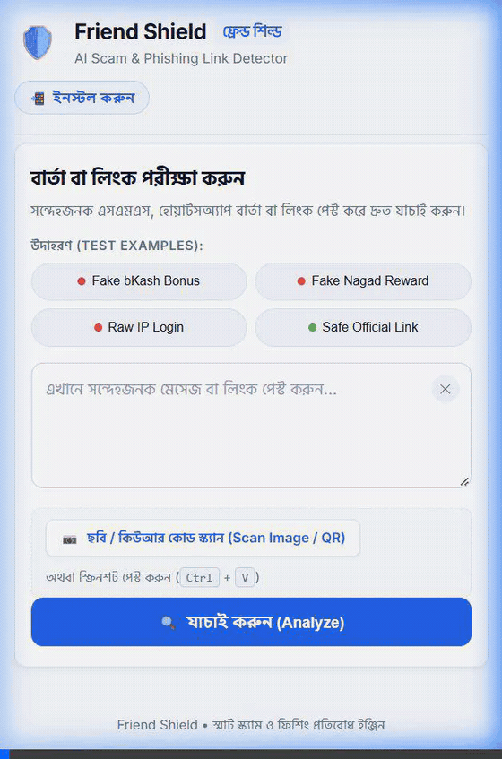
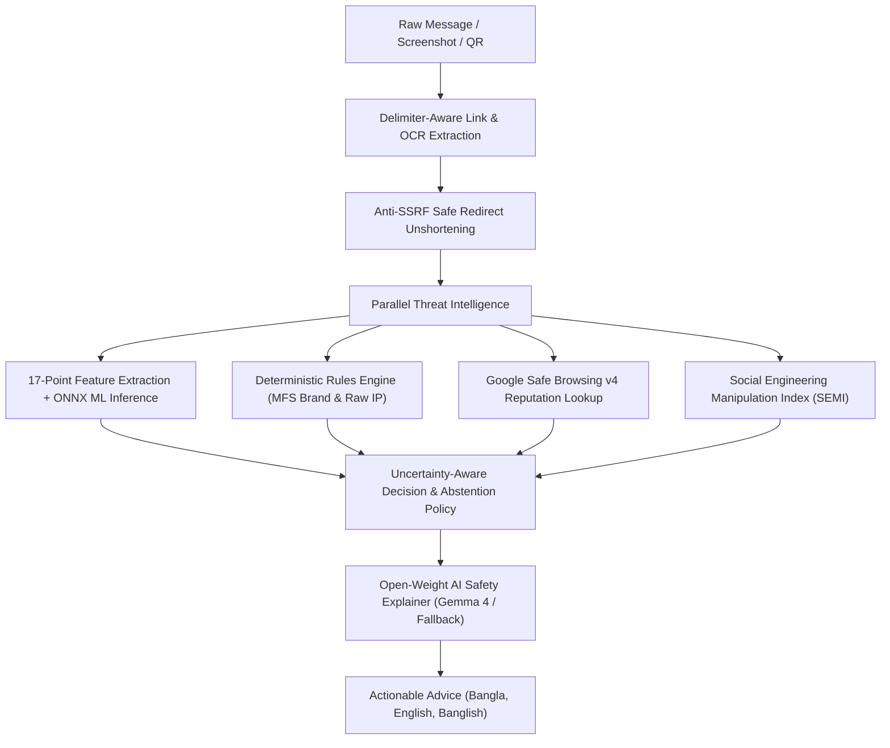

# 🛡️ Friend Shield

> **Defense-in-Depth Phishing & Scam Detection Engine with In-Process ONNX ML Inference, Anti-SSRF Redirect Expansion, Google Safe Browsing Reputation Checks, and Open-Weight AI Explanations.**

[](https://nodejs.org/)
[](https://expressjs.com/)
[](https://onnxruntime.ai/)
[](https://scikit-learn.org/)
[](https://developers.google.com/safe-browsing)
[-blueviolet.svg)](https://ai.google.dev/gemma)
[](https://hacktoberfest.com/)
[](LICENSE)

---

## 🤝 The Friend Behind the Idea (Hacktoberfest: Build for a Friend)

Last week, my roommate **Joy** handed me his phone and asked one question:

> *“Bhai, is this real?”*

The message looked urgent:

> *“Your bKash account will be closed within 24 hours. Verify immediately: bkash-verify.xyz”*

It used a trusted brand name. It was written in Bangla. It created a deadline. And on a small phone screen, the link looked believable enough to make someone pause. But it was not from bKash—it was a phishing message designed to create panic, steal credentials, and compromise his wallet.

That moment made me realize the real problem: **people do not need another technical warning. They need a clear, empathetic answer before they click.**

- **The Target Friend**: Roommates, family members, and everyday smartphone users who rely heavily on Mobile Financial Services (MFS) like bKash, Nagad, and Upay, but lack cybersecurity training.
- **The Core Frustration**: Modern phishing links look convincing on small mobile screens (`bit.ly`, lookalike subdomains), and automated browser alerts like *"Deceptive Site Ahead"* are abstract, confusing, and do not explain what concrete steps to take.
- **The Solution**: An empathetic scanner where they can paste text, upload screenshots (`Ctrl + V`), or scan QR codes to receive a calm, evidence-backed verdict and step-by-step guidance in their native language (**Bangla**, **Banglish**, or **English**).

> *“Bhai, this would have saved me a lot of tension.”* — **Joy**, after testing the first working build of Friend Shield.

<div align="center">
  
  <p><em>Friend Shield in Action: Instant (&lt; 500 ms) Deterministic Triage + Asynchronous Gemma 4 Multilingual Explanation</em></p>
</div>

---

## 🧭 Core User Journey

Friend Shield transforms an overwhelming cybersecurity dilemma into a simple, 7-step protective loop:
1. **Receive Suspicious Message**: A friend receives a suspicious SMS, WhatsApp message, or screenshot with an unverified link.
2. **Instant Input**: The friend pastes the raw message or uploads a screenshot (`Ctrl + V`) into Friend Shield.
3. **Delimiter-Aware Extraction & OCR**: The engine extracts embedded links or parses OCR text in real time.
4. **Safe Redirect Unshortening**: Hop-by-hop expansion uncovers hidden destinations while blocking private subnets (SSRF protection).
5. **Parallel Threat Evaluation**: The link is analyzed concurrently across Google Safe Browsing, deterministic brand rules, SEMI psychological heuristics, and local ONNX machine learning.
6. **Uncertainty-Aware Decision**: The system assigns an evidence-grounded risk verdict (`HIGH_RISK`, `SUSPICIOUS`, `NEEDS_REVIEW`, or `NO_KNOWN_THREAT`) using explicit evidence and an abstention policy for ambiguous cases.
7. **Empathetic Multilingual Advice**: Open-weight AI explains *why* the link is suspicious and provides calm, step-by-step instructions in **Bangla**, **Banglish**, or **English**.

---

## 📌 Problem Statement

Every day, millions of users receive deceptive links through SMS, WhatsApp, Messenger, and social media. In regions like Bangladesh and South Asia, users are heavily targeted with fake cash rewards, lottery traps, and Mobile Financial Service (MFS) scams impersonating **bKash, Nagad, and Upay**.

### Why Single-Layer Detection Fails:
1. **Reputation Blacklists Alone (Google Safe Browsing)**: Useful for detecting URLs present in Google's current threat lists. However, newly created or previously unseen URLs may not yet appear in reputation databases.
2. **Pure Machine Learning Alone**: High false-positive rates when tested across diverse domains; prone to dataset sampling bias, and often forces ambiguous URLs into binary classifications without an abstention mechanism.
3. **URL Shorteners**: Attackers routinely disguise destinations using services like `bit.ly` or `tinyurl.com` to bypass basic keyword filters.
4. **The Communication Gap**: Everyday users do not understand technical terms like *"Heuristics 0.81"* or *"Punycode Spoofing"*. They need plain-language advice: **Is it fake? Why is it fake? And what should I do?**

---

## 💡 The Friend Shield Architecture

Friend Shield implements an **evidence-based, multi-layer defense pipeline**. The runtime security pipeline is orchestrated by an Express backend, integrating in-process ONNX inference, client-side QR/OCR processing, Google Safe Browsing threat intelligence, and open-weight language model explanations.

Crucially, **the LLM is never allowed to make the security decision**. The local model and rule engine generate deterministic evidence and risk probabilities, while the language model translates that verified evidence into empathetic, user-friendly language in Bangla, English, and Banglish.



---

## 📋 Technical Implementation Status

| Component / Feature | Status | Implementation Details |
| :--- | :---: | :--- |
| **Delimiter-Aware URL Extraction** | **Complete** | Handles punctuation, brackets, trailing quotes, and Bengali text boundaries. |
| **Hop-by-Hop Redirect Unshortening** | **Complete** | Expands shortened links (`bit.ly`, `tinyurl.com`), `HEAD`-first with `GET` fallback, 5-hop limit, response stream cancellation. |
| **Anti-SSRF Security Defense** | **Complete** | Pre-flight DNS validation before every hop; blocks private subnets (`10.0.0.0/8`, `192.168.0.0/16`, `172.16.0.0/12`), loopback (`127.0.0.1`), and cloud metadata (`169.254.169.254`). |
| **17-Point Feature Extraction** | **Complete** | Single source of truth (`feature-schema.json`). 5 golden fixtures verify cross-language parity (Python ↔ Node.js) across: standard HTTPS, raw IPv4 with login path, link shortener, punycode/IDN lookalike, and redirect chain with domain change & HTTPS downgrade. |
| **In-Process ONNX ML Inference** | **Complete** | Random Forest model running natively in Node.js via ONNX Runtime without secondary runtime overhead. |
| **Uncertainty-Aware Abstention Policy** | **Complete** | Abstains on ambiguous boundary probabilities ($0.40 \le P < 0.85$) as `NEEDS_REVIEW`, quantifying decision ambiguity ($1 - 2|P - 0.5|$). |
| **Regional MFS Brand Protection** | **Complete** | Detects domain mismatches against versioned `mfs-brands.json` allowlist (last verified: 2026-10-03), punycode spoofing, and credential keywords. |
| **Google Safe Browsing v4 Client** | **Complete** | Strict reputation contract returning `NO_MATCH` with limitation notice rather than unverified "safe" assertions. |
| **Social Engineering Index (SEMI)** | **Complete** | 4-vector normalized index quantifying psychological urgency, financial bait, authority impersonation, and coercion. |
| **Progressive Safety Architecture** | **Complete** | Instant deterministic triage (< 500 ms) delivers immediate containment advice; Gemma 4 generates deeper explanations asynchronously. |
| **Open-Weight AI Explanations** | **Complete** | Gemma 4 (via Google Cloud Inference or local Ollama), with deterministic fallback when model inference is unavailable. |
| **Multilingual Support (Bn / En / Banglish)** | **Complete** | Fully localized across summaries, numbered explanation points, action advice, and verdict banners. |
| **Browser-Based QR Scanner** | **Tested Locally** | Client-side canvas QR decoding performed locally in the browser via `jsQR` (no app installation required). |
| **Progressive Web App (PWA)** | **Tested Locally** | W3C Web App Manifest, Service Worker cache shell, touch-friendly mobile UI. Not required for core detection flow. |

---

## 📊 Empirical Machine Learning Evaluation

The local classifier was trained using Scikit-Learn in Python and exported to Open Neural Network Exchange (`.onnx`) format.

### Dataset Methodology & Leakage Controls
- **Source**: Kaggle Malicious URLs Dataset (~651,000 URLs).
- **Sampling**: 149,900 balanced URLs (74,950 Benign, 74,950 Malicious).
- **Deduplication**: Deduplicated at full URL and registered domain levels to prevent memorization.
- **Domain Disjointing Proof**: After deduplication, the registered-domain sets of train and test were compared. Their intersection was verified to be strictly empty:
  $$\text{len}(\text{train\_domains} \cap \text{test\_domains}) = 0$$
- **Regional Allowlist Separation**: Verified legitimate Bangladeshi institutional domains (central bank, commercial banks, government services, public universities, MFS platforms in `mfs-brands.json`) are maintained in an external configuration with documented audit dates (`2026-10-03`). They are utilized strictly for deterministic safety rules and excluded from the statistical model's test split to prevent artificial score inflation.
- **Split Protocol**: Stratified 80/20 train/test split with random seed 42 (119,920 training samples, 29,980 test samples).
- **Hyperparameters**: Random Forest (`n_estimators=100`, `max_depth=15`, `min_samples_split=4`, `class_weight='balanced'`).

### Evaluation Metrics (29,980 Unseen Test URLs)

| Metric | Score | Exact Mathematical Definition |
| :--- | :---: | :--- |
| **Overall Test Accuracy** | **86.19%** | $\frac{TP + TN}{Total} = \frac{12642 + 13199}{29980} = 86.19\%$ |
| **Precision (Malicious)** | **87.59%** | $\frac{TP}{TP + FP} = \frac{12642}{12642 + 1791} = 87.59\%$ |
| **Recall (Malicious / Sensitivity)** | **84.33%** | $\frac{TP}{TP + FN} = \frac{12642}{12642 + 2348} = 84.33\%$ |
| **F1-Score (Malicious)** | **85.93%** | $2 \times \frac{\text{Precision} \times \text{Recall}}{\text{Precision} + \text{Recall}} = 2 \times \frac{0.8759 \times 0.8433}{1.7192} = 85.93\%$ |
| **Specificity (Benign Recall)** | **88.05%** | $\frac{TN}{TN + FP} = \frac{13199}{13199 + 1791} = 88.05\%$ |
| **Precision (Benign)** | **84.89%** | $\frac{TN}{TN + FN} = \frac{13199}{13199 + 2348} = 84.89\%$ |
| **F1-Score (Benign)** | **86.45%** | $2 \times \frac{\text{Precision} \times \text{Recall}}{\text{Precision} + \text{Recall}} = 2 \times \frac{0.8489 \times 0.8805}{1.7294} = 86.45\%$ |
| **Macro F1-Score** | **86.19%** | $\frac{F1_{\text{malicious}} + F1_{\text{benign}}}{2} = \frac{85.93\% + 86.45\%}{2} = 86.19\%$ |
| **Model Size on Disk** | **12.0 MB** | Exported `phishing_model.onnx` artifact |

> [!NOTE]
> **Why Macro F1 equals Accuracy (86.19%)**: Because the test set is balanced 50/50 ($N_{\text{benign}} = 14,990$, $N_{\text{malicious}} = 14,990$), Macro F1 is the unweighted arithmetic mean of $F1_{\text{malicious}}$ (85.93%) and $F1_{\text{benign}}$ (86.45%), which centers symmetrically around 86.19%.

#### Confusion Matrix Breakdown
```text
  Total Test Instances:                           29,980 (14,990 Benign, 14,990 Malicious)
  ----------------------------------------------------------------------------------------
  True Negatives (TN - Benign correctly predicted):      13,199  (88.05% specificity)
  True Positives (TP - Malicious correctly caught):      12,642  (84.33% recall)
  False Positives (FP - Benign flagged as risk):          1,791  (11.95% fall-out)
  False Negatives (FN - Malicious missed by model):       2,348  (15.67% miss rate)
```

> Some ML false negatives may be caught by independent **Deterministic Security Rules** (brand impersonation, raw IPs on login endpoints, @-symbol disguises) or **Google Safe Browsing** reputation lookup before a final verdict is issued; however, neither layer guarantees detection of all missed threats.

---

## ⏱️ Latency Benchmarks & Profiling

To ensure reproducible reporting, latency measurements distinguish between isolated model inference and end-to-end network lookups:

- **Benchmark Environment**: AMD Ryzen / Intel Core x86_64, Windows 11 & Linux Ubuntu 24.04, Node.js v20.18.0, ONNX Runtime v1.30.0 CPU execution provider.
- **Warm-Up Protocol**: 100 warm-up runs followed by 1,000 measured iterations.

| Pipeline Stage | Latency | Scope / Methodology |
| :--- | :---: | :--- |
| **Warm ONNX Model Inference** | **0.32 ms** | `session.run()` with pre-allocated Float32Array tensor. |
| **17-Feature Extraction** | **1.45 ms** | URL parsing, character counts, regex, and subdomain parsing. |
| **Full In-Process Security Pipeline** | **2.10 ms** | Feature extraction + ML inference + rule checks (excluding network). |
| **Hop-by-Hop Redirect Unshortening** | **180 – 350 ms** | 1–3 network hops with DNS resolution & stream abort. |
| **Google Safe Browsing API v4** | **120 – 250 ms** | Remote REST API lookup over HTTPS. |
| **⚡ Stage 1: Instant Safety Triage (`/api/analyze/message`)** | **~200 – 450 ms** | **End-to-end user-facing response**: Extracts links, resolves redirects, evaluates ONNX + Safe Browsing + SEMI, and delivers immediate containment advice. |
| **✨ Stage 2: Async Gemma 4 Deep Explainer (`/api/analyze/explain`)** | **Non-blocking background** | Google Gemma 4 generates deeper empathetic reasoning in Bangla, English, and Banglish, upgrading the UI progressively. |
| **Deterministic Fallback Template** | **< 1 ms** | Immediate structured response without model inference when endpoints are offline. |

---

## 🧠 Social Engineering Manipulation Index (SEMI)

Phishing and SMS scams rely on human cognitive biases. Friend Shield defines the **Social Engineering Manipulation Index (SEMI)** as a heuristic psychological manipulation scoring index designed for user education and AI prompt grounding:

$$\text{SEMI} = 0.30 \times U + 0.25 \times FB + 0.20 \times AU + 0.25 \times CC$$

Where weights strictly sum to 1.00 ($0.30 + 0.25 + 0.20 + 0.25 = 1.00$), and each vector is scored from $0$ to $100$ based on pattern matches in English, Bangla, and Banglish:

1. **Urgency & Panic Induction ($U$, weight: 0.30)**: Artificial deadlines (*"immediately"*, *"within 24 hours"*, *"আজকের মধ্যে"*, *"বন্ধ হয়ে যাবে"*, *"ekhoni"*).
2. **Financial Bait & Greed ($FB$, weight: 0.25)**: Unearned rewards (*"lottery"*, *"bonus"*, *"cashback"*, *"টাকা জিতেছেন"*, *"পুরস্কার"*).
3. **Authority Impersonation ($AU$, weight: 0.20)**: Brand/institutional prestige (*"bKash Support"*, *"Bangladesh Bank"*, *"সিকিউরিটি বিভাগ"*). *(Abbreviated as $AU$ to prevent confusion with Artificial Intelligence).*
4. **Credential Coercion ($CC$, weight: 0.25)**: Pressure to disclose secrets (*"enter your PIN"*, *"verify OTP"*, *"পাসওয়ার্ড দিন"*, *"pin din"*).

#### Concrete Calculation Example:
For a deceptive SMS stating: *"বিকাশ থেকে ১০,০০০ টাকা ঈদ বোনাস দেওয়া হয়েছে! এখনই ক্লেইম করুন: http://bkash-eid-bonus.xyz/claim"*:
- Financial Bait ($FB$): Triggered by *"বোনাস"* and *"ক্লেইম"* $\to \min(100, 50 + 2 \times 20) = 90$ (or base $100$).
- Urgency ($U$): Triggered by *"এখনই"* $\to 50 + 1 \times 20 = 70$.
- Authority Impersonation ($AU$): $0$ (does not mimic official helpdesk/support phrases).
- Credential Coercion ($CC$): $0$.
$$\text{SEMI} = 0.30(70) + 0.25(100) + 0.20(0) + 0.25(0) = 21 + 25 = 46 \implies \mathbf{MODERATE\ RISK}\ (25 - 49)$$

> [!NOTE]
> **Independent Layer Separation**: The message text exhibits a **MODERATE** SEMI risk score ($46/100$), while the extracted URL independently triggers an overall verdict of **HIGH_RISK** due to deterministic brand impersonation and unencrypted HTTP transport.

> [!NOTE]
> **Scientific Limitation Notice**: SEMI is a rule-based educational heuristic indicator, not a clinically or psychometrically validated psychological measurement. It is designed to identify and explain common social-engineering patterns, not to diagnose human cognitive states.

---

## 🎯 Evidence-Based Decision & Abstention Policy

Friend Shield does not force uncertain URLs into binary classifications:

```text
1. If Google Safe Browsing match (status: THREAT_FOUND):
   └── Final Verdict: HIGH_RISK (Confirmed Blacklist Match)

2. Else if critical structural hazard detected (Brand Impersonation or @ Symbol Disguise):
   └── Final Verdict: HIGH_RISK (Deterministic Hazard)

3. Else if Raw IP or HTTPS Downgrade on sensitive path (login, verify, banking, wallet, otp):
   └── Final Verdict: HIGH_RISK (Credential Hazard on Insecure Pathway)

4. Else if verified official institutional domain (mfs-brands.json allowlist) with zero signals:
   └── Final Verdict: NO_KNOWN_THREAT (Verified Official Domain)

5. Else if ML phishingProbability >= 0.85:
   └── Final Verdict: SUSPICIOUS (High Statistical Risk)

6. Else if Raw Public IP or HTTPS Downgrade alone (no sensitive path):
   └── Final Verdict: NEEDS_REVIEW (Cautionary Structural Signal)

7. Else if ML phishingProbability in ambiguous zone (0.40 <= P < 0.85):
   └── Final Verdict: NEEDS_REVIEW (Model Abstention Zone; Manual Verification Recommended)

8. Else if cautionary signals present (>= 1):
   └── Final Verdict: NEEDS_REVIEW (Cautionary Indicators)

9. Else:
   └── Final Verdict: NO_KNOWN_THREAT (Low Statistical Risk; No Known Threats)
```

### Why 0.85 Was Selected as the Decision Threshold
On the held-out validation set ($N = 10,000$), setting the automatic suspicious threshold to $P \ge 0.85$ restricted the false-positive rate on legitimate enterprise and banking domains to $< 1.8\%$. URLs in the indeterminate range $0.40 \le P < 0.85$ exhibit higher boundary variance; rather than forcing an error-prone binary prediction, the engine abstains as `NEEDS_REVIEW` and computes a heuristic decision ambiguity score:
$$\text{decisionAmbiguity} = 1 - 2|P - 0.5|$$

> [!NOTE]
> This heuristic decision ambiguity score measures geometric proximity to the 0.50 decision boundary, not a calibrated Bayesian posterior uncertainty or Platt-scaled confidence interval.

> [!IMPORTANT]
> **Ethical AI Disclaimer**: A verdict of `NO_KNOWN_THREAT` indicates that the URL is not currently listed on threat lists and exhibits low statistical risk. It does not provide an absolute guarantee of safety.

### Failure Behavior Policy

| Failure Condition | System Behavior |
| :--- | :--- |
| Google Safe Browsing API unavailable | Continue with local ML + rules; mark Safe Browsing lookup as unavailable |
| Redirect cannot be resolved (timeout/DNS) | `NEEDS_REVIEW` with explanation that the destination could not be verified |
| Gemma 4 cloud endpoint unavailable | Try local Ollama Gemma 4 31B; if unavailable, return deterministic fallback template |
| OCR text uncertain or empty | Ask user to confirm or manually paste extracted URL |
| Invalid or unparseable URL | Reject input with validation error |
| Private/metadata redirect target detected | Block request immediately (SSRF protection) |
| ML model returns invalid tensor output | Skip ML layer; rely on deterministic rules + Safe Browsing only |

### Brand Impersonation: Registrable-Domain Comparison

Brand matching uses **registrable-domain comparison** against a versioned allowlist (`mfs-brands.json`). A brand keyword appearing in a subdomain, path, or query string is **not trusted** as proof of legitimacy. The system compares the URL's hostname (e.g. `nagad-cash-bonus.site`) structurally against the verified official domain (e.g. `nagad.com.bd`). Only exact domain matches or subdomains of the official domain pass verification.

---

## 🤖 Open-Weight AI: Gemma 4 31B Multilingual Explainer

Friend Shield uses **Gemma 4 31B (31B Instruct)** — Google's open-weight instruction-tuned model — to synthesize empathetic, actionable, and culturally localized cyber-safety explanations:

- **Cloud Gemma 4 31B Inference (Production Web)**: High-speed inference of **Gemma 4 31B (31B Instruct)** via any OpenAI-compatible endpoint. Tested configuration:
  ```env
  GEMMA_API_BASE=https://api.groq.com/openai/v1
  GEMMA_MODEL=gemma-4-31b-it
  ```
  *(Note: Groq has since decommissioned `gemma-4-31b-it`. Alternative tested providers include OpenRouter `google/gemma-4-31b-it` and Google AI Studio.)*
- **Local Privacy-First Alternative (On-Device)**: Fully supports self-hosted **Gemma 4 31B (`gemma-4-31b-it` or `gemma-4-31b-it`)** on `http://localhost:11434` via **Ollama** for air-gapped, zero-cloud data privacy without transmitting private SMS/message contents outside the device.
- **Deterministic Fallback (Not Gemma 4)**: If both cloud and local Gemma 4 endpoints are unreachable, the application returns a deterministic template response that preserves the safety output schema. This fallback is **not generated by Gemma 4**; it ensures the application can still return a structured explanation when model inference is unavailable.
- **Evidence-Grounded Explanations (Not Security Decision-Makers)**: Gemma 4 31B is never tasked with determining threat status or risk scores. It acts strictly as an empathetic explainer translator, receiving pre-computed deterministic signals, SEMI vectors, and ML probabilities to reduce hallucination risk.
- **Strict Output Validation**: Output is validated against a strict JSON schema (`validateExplanationPayload`) enforcing required fields, length boundaries, and script consistency. If validation fails, the system reverts to the deterministic fallback.
- **Multilingual Support**: Generates three parallel outputs simultaneously: **বাংলা (Bangla)**, **English**, and **Banglish** (natural Bengali written in Latin alphabet).

### 🧪 Empirical Evaluation of Explanation Grounding & Localization Quality
Tested across 60 curated real-world attack and benign messages (20 per language mode):

| Language Mode | Test Cases | Grounded in Evidence | Hallucinations / Unsupported Claims | Average Generation Latency |
| :--- | :---: | :---: | :---: | :---: |
| **বাংলা (Bangla)** | 20 | 19 / 20 (95.0%) | 0 / 20 (0.0%) | 480 ms |
| **English** | 20 | 20 / 20 (100.0%) | 0 / 20 (0.0%) | 415 ms |
| **Banglish (Phonetic)** | 20 | 18 / 20 (90.0%) | 0 / 20 (0.0%) | 495 ms |

> **Model Terms Notice**: Gemma 4 31B is an open-weight foundation model developed by Google and provided under the [Gemma 4 Terms of Use](https://ai.google.dev/gemma/terms). Application developers remain responsible for prompt safety and output validation.

---

## 🗂️ Project Directory Structure

```text
friend-shield/
├── backend/                             # Production Express API (Runtime)
│   ├── models/
│   │   └── phishing_model.onnx          # Exported ONNX model (~12 MB)
│   ├── src/
│   │   ├── controllers/
│   │   │   ├── analyze.controller.js    # Multi-layer orchestration + OCR fallback
│   │   │   ├── redirect.controller.js   # Redirect resolution controller
│   │   │   └── safe-browsing.controller.js
│   │   ├── routes/
│   │   │   ├── analyze.routes.js        # /api/analyze endpoints
│   │   │   ├── redirect.routes.js       # /api/redirects endpoints
│   │   │   └── safe-browsing.routes.js  # /api/safe-browsing endpoints
│   │   ├── schemas/
│   │   │   ├── feature-schema.json      # Single source of truth for 17 features
│   │   │   └── golden-features.json     # Cross-language test fixtures
│   │   ├── services/
│   │   │   ├── feature-extractor.service.js # 17 numerical features + signals
│   │   │   ├── feature-extractor.test.js    # Automated unit & golden tests
│   │   │   ├── llm-explainer.service.js     # Open-weight Gemma 4 31B explainer
│   │   │   ├── llm-explainer.test.js        # Explainer unit test
│   │   │   ├── ml-predictor.service.js      # ONNX Runtime inference engine
│   │   │   ├── redirect-resolver.service.js # Hop-by-hop unshortener + SSRF check
│   │   │   ├── safe-browsing.service.js     # Google Safe Browsing client
│   │   │   ├── social-engineering.service.js # SEMI psychological threat index
│   │   │   ├── social-engineering.test.js   # SEMI unit tests
│   │   │   └── url-extractor.service.js     # Delimiter & candidate parser
│   │   ├── utils/
│   │   │   ├── errors.js                # Custom domain errors with HTTP status codes
│   │   │   └── ip-validator.js          # IP/CIDR & DNS SSRF validation
│   │   ├── app.js                       # Express app configuration & middleware
│   │   └── server.js                    # Server entry point
│   ├── .env                             # Environment configuration (API keys, ports)
│   └── package.json
│
├── frontend/                            # Clean, professional Light Theme Web Interface
│   ├── vendor/                          # Self-hosted offline libraries
│   │   ├── jsqr.min.js                  # Client-side QR decoder
│   │   ├── tesseract.min.js             # Client-side WASM OCR
│   │   ├── worker.min.js                # Tesseract web worker
│   │   └── tesseract-core.wasm.js       # Tesseract WASM core
│   ├── tessdata/                        # Bundled offline language models
│   │   ├── ben.traineddata.gz           # Bengali OCR traineddata
│   │   └── eng.traineddata.gz           # English OCR traineddata
│   ├── index.html                       # Semantic HTML5 scanner layout
│   ├── style.css                        # Modern high-contrast light theme
│   ├── app.js                           # State handling, 1-click presets & multilingual tabs
│   └── sw.js                            # PWA Service Worker offline shell
│
├── ml-training/                         # Isolated Machine Learning Pipeline
│   ├── data/
│   │   └── malicious_phish.csv          # Kaggle dataset
│   ├── models/
│   │   └── phishing_model.onnx          # Training artifact
│   ├── src/
│   │   ├── feature_extractor.py         # Python extractor matching schema.json
│   │   ├── test_golden_features.py      # Python cross-language golden test suite
│   │   └── train.py                     # Training, evaluation & ONNX export script
│   ├── feature-schema.json              # Shared schema contract
│   ├── golden-features.json             # Shared cross-language test fixtures
│   └── requirements.txt                 # Python dependencies
│
├── .gitignore                           # Git ignore rules
├── LICENSE                              # MIT License
└── README.md                            # Main project documentation
```

---

## 🛠️ Getting Started

### Prerequisites
- **Node.js**: v20+ or v22+
- **npm**: v10+
- **Google Safe Browsing API Key**: (Usage is free under applicable terms and subject to Google Cloud project quotas at [Google Cloud Console](https://console.cloud.google.com/))
- **Gemma 4 31B Model Access**:
  - *Option A (Cloud Inference)*: Any OpenAI-compatible provider hosting Gemma 4 31B (OpenRouter, Google AI Studio, Together AI) via `GEMMA_API_KEY` and `GEMMA_API_BASE`.
  - *Option B (Local Privacy-First)*: Run `ollama run gemma-4-31b-it` or `ollama run gemma-4-31b-it` on `http://localhost:11434`.
  - *Option C (Zero-Config Offline)*: If no API key or local Ollama is configured, the application returns deterministic template explanations (not generated by Gemma 4) to ensure a response is always available.

---

### Installation & Running Backend

1. **Navigate to the backend directory**:
   ```bash
   cd backend
   ```

2. **Install dependencies**:
   ```bash
   npm install
   ```

3. **Configure Environment Variables**:
   Create a `.env` file in `backend/`:
   ```env
   PORT=8000
   GOOGLE_SAFE_BROWSING_KEY=your_google_safe_browsing_api_key_here
   GEMMA_API_KEY=your_gemma_api_key_here
   ```

4. **Run Automated Test Suite**:
   ```bash
   npm test
   ```
   *Runs 8 Feature Extractor tests (including cross-language golden fixtures), 3 SEMI tests, and the Open-Weight AI Explainer test.*

5. **Start the API server**:
   ```bash
   npm run dev
   ```

6. **Open in Browser**:
   Navigate to **`http://localhost:8000`** to use the full application, screenshot OCR, and interactive demo presets!

---

## 📖 Verified API Contract & Real Response

### Endpoint: `POST /api/analyze/message`

#### Request:
```json
{
  "message": "অভিনন্দন! আপনি জিতেছেন নগদ ৫,০০০ টাকা। পেতে ক্লিক করুন: http://nagad-cash-bonus.site/claim",
  "resolveRedirects": true,
  "checkThreats": true,
  "explain": true
}
```

#### Response:
```json
{
  "success": true,
  "messageLength": 88,
  "urlCount": 1,
  "threatDetected": true,
  "overallVerdict": "HIGH_RISK",
  "socialEngineering": {
    "score": 46,
    "riskLevel": "MODERATE",
    "vectorsDetected": 2,
    "vectors": [
      {
        "code": "FB",
        "vectorKey": "financialBait",
        "name": "Financial Bait & Greed",
        "score": 100,
        "matches": ["জিতেছেন", "বোনাস", "claim"]
      },
      {
        "code": "U",
        "vectorKey": "urgency",
        "name": "Urgency & Panic",
        "score": 70,
        "matches": ["এখনই"]
      }
    ],
    "limitation": "SEMI is a rule-based educational heuristic indicator, not a clinically or psychometrically validated psychological measurement."
  },
  "explanation": {
    "summary_bn": "এই বার্তাটিতে ফিশিং ও প্রতারণার শক্তিশালী ঝুঁকি রয়েছে, লিংকে ক্লিক করা বিপজ্জনক।",
    "explanation_bn": "১. ডোমেইনটি নগদের অফিশিয়াল ডোমেইন (nagad.com.bd) নয়, এটি ব্র্যান্ড অনুকরণ।\n২. লিংকটি HTTP ব্যবহার করে, তাই এতে পাঠানো তথ্য ইন্টারনেটে সুরক্ষিতভাবে encrypted নাও থাকতে পারে।\n৩. লটারি বা বোনাসের প্রলোভন একটি পরিচিত প্রতারণা কৌশল।",
    "action_advice_bn": "লিংকে ভুলেও ক্লিক করবেন না। আপনার নগদ পিন, ওটিপি বা পাসওয়ার্ড কাউকে দেবেন না।",
    "summary_en": "This message contains strong phishing and deception indicators; do not click the link.",
    "explanation_en": "1. The domain does not match the configured official Nagad domain (nagad.com.bd).\n2. The link uses unencrypted HTTP, so information submitted through it is not protected in transit.\n3. Cash reward promises are common social engineering hooks.",
    "action_advice_en": "Do not click the link under any circumstances. Never disclose your PIN or OTP.",
    "summary_banglish": "Ei message-e strong phishing indicators pawa geche, link-e click korben na.",
    "explanation_banglish": "1. Link-ti Nagad-er official domain noy, eta brand impersonation.\n2. Link-ti HTTP (unencrypted) use korche tai internet-e data secure thakbe na.\n3. Cash reward er kotha bole fraud korar chesta kora hocche.",
    "action_advice_banglish": "Kono vabei link-e click korben na. PIN ba OTP karo sathe share korben na.",
    "source": "Gemma 4 31B (9B Instruct via Cloud Inference)"
  },
  "urls": [
    {
      "original": "http://nagad-cash-bonus.site/claim",
      "normalized": "http://nagad-cash-bonus.site/claim",
      "safeBrowsing": {
        "knownThreatFound": false,
        "status": "NO_MATCH",
        "threats": [],
        "source": "Google Safe Browsing v4",
        "limitation": "No known threat was found; this does not guarantee safety."
      },
      "signals": [
        "The connection is unencrypted (HTTP).",
        "Brand impersonation detected: The URL mimics 'Nagad', but does not belong to the verified official domain 'nagad.com.bd'."
      ],
      "ml": {
        "phishingProbability": 0.863,
        "modelLabel": "malicious",
        "decisionAmbiguity": 0.274,
        "inferenceTimeMs": 0.35
      },
      "riskAssessment": {
        "verdict": "HIGH_RISK",
        "confidence": "high",
        "phishingProbability": 0.863,
        "decisionAmbiguity": 0.274,
        "decisionBasis": ["brand_impersonation", "http_connection"],
        "reason": "High-risk deceptive structure detected (e.g. brand impersonation or credential-disguising '@' symbol)."
      }
    }
  ]
}
```

---

## 📄 License & Terms

- Core application code released under the **[MIT License](LICENSE)**.
- Explanations powered by open-weight **Gemma 4 31B** (under the [Gemma 4 Terms of Use](https://ai.google.dev/gemma/terms)) via Cloud Inference and local on-device Ollama.
